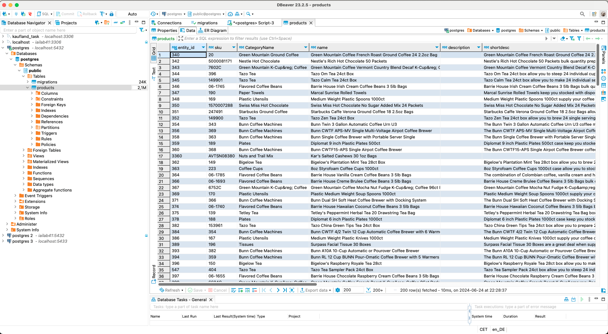
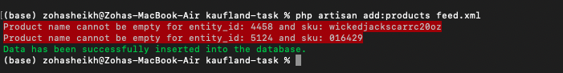
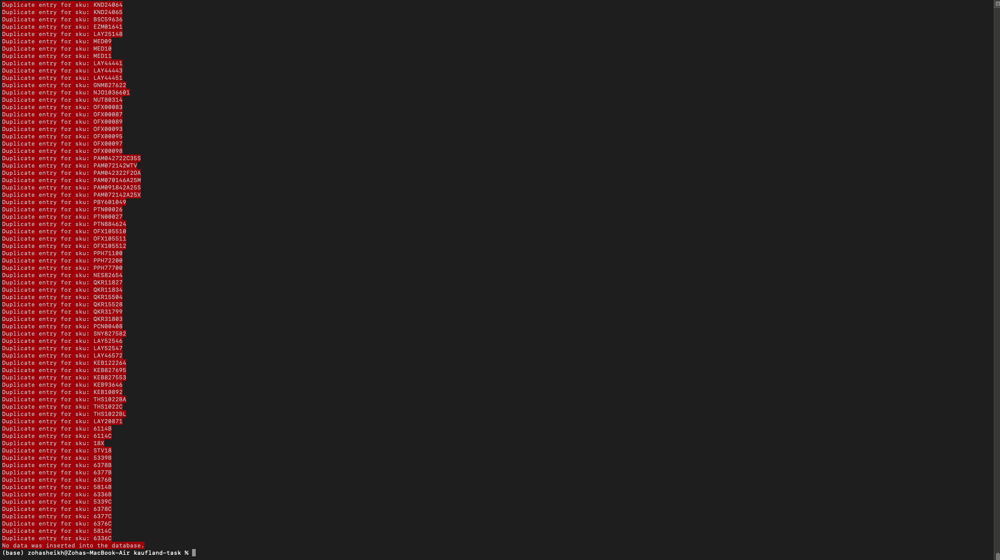
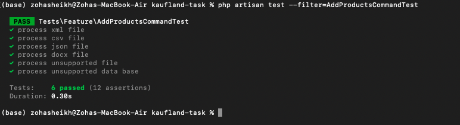

# kaufland-task
The task was to create a command-line program that processes an XML file and pushes the data to a chosen database. This has been achieved by developing a Laravel Command capable of handling various file formats (XML, CSV, JSON, and DOCX), with the flexibility to easily add more formats. The processed data is then pushed to the specified database. The program is designed to be flexible enough to load half of the data from one file format and the other half from another format, for example, half from a CSV file and half from an XML file, without creating duplicate records. Errors are logged in the Laravel log files, and the task is tested using test cases that identify potential issues when running the command with different file formats.

## Prerequisites
- PHP: 8.3.8
- Laravel Framework: 11.11.1
- PostgreSQL: 16.1

## Essential Files
- Command-line Program: '/app/Console/Commands/AddProductsCommand.php'
- Parsers: '/Users/zohasheikh/kaufland-task/app/Parsers/*.php'
- Migration: '/database/migrations/2024_06_22_011258_create_products_table.php'
- Test Cases: '/tests/Feature/AddProductsCommandTest.php'
- Logs: '/storage/logs/*.log'
- Data Files: '/data_files/'
- Test Files: '/tests/files/'

## Commands
- Migration: php artisan migrate
- Add Products Command: php artisan add:products {file} {dbType=pgsql}
- Test Case: php artisan test --filter=ProcessDataCommandTest

**Note:** The program is configurable, allowing you to easily add more file formats and different databases. The default database is set to 'PostgreSQL', so you can omit the dbtype parameter when running the command. The final command can be written as: 

```sh
php artisan add:products data_files/feed.xml 
```
Different database (e.g., 'SQLite'), you can run:

```sh
php artisan add:products data_files/feed.xml sqlite
```
## Constraints
- Entity ID: Primary Key
- SKU: Unique Key
- Name: Not nullable
- Created_AT: Track the creation time of product
- Updated_AT: Track the updation time of product

## Screenshots
Data is entered into the 'products' table in the 'PostgreSQL' database


Successful entry of the data using command-line program


Duplicate entry error when SKU is already present


Execution of the test cases


